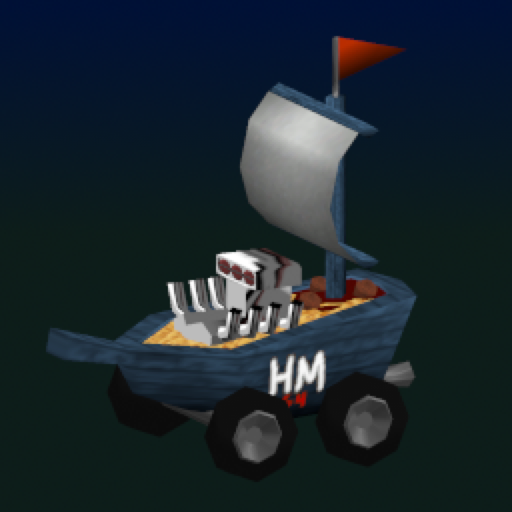

<p align="center">
  
</p>

# SpaghettiKart — macOS

A macOS-optimized fork of [HarbourMasters/SpaghettiKart](https://github.com/HarbourMasters/SpaghettiKart)
(a Mario Kart 64 PC port built on [libultraship](https://github.com/Kenix3/libultraship)).

The goal of this fork is simple: **a plain build produces a self-contained, codesigned
`SpaghettiKart.app`** that launches on any modern Apple-Silicon Mac with no extra setup, plus the
handful of fixes needed to build cleanly on a current Apple-clang / CMake toolchain. Gameplay,
assets, and the rest of the project are unchanged from upstream — you still provide your own US ROM.

---

## Download & run

1. Grab `SpaghettiKart-v1.0.0-macOS-arm64.zip` from
   [Releases](https://github.com/quarrel07/SpaghettiKart-macOS/releases) and unzip it.
2. The app is **ad-hoc codesigned**, so on first launch right-click `SpaghettiKart.app` → **Open**
   (or run `xattr -dr com.apple.quarantine SpaghettiKart.app`) to get past Gatekeeper.
3. On first run the game asks for your **US Mario Kart 64 ROM** (`.z64`, SHA-1
   `579C48E211AE952530FFC8738709F078D5DD215E`). It extracts `mk64.o2r` into
   `~/Library/Application Support/com.spaghettikart/` — this can take a minute. After that it boots
   straight to the game.

No copyrighted assets are bundled. You must supply your own legally-dumped ROM.

## What this fork changes

| # | Area | Fix |
|---|------|-----|
| 1 | **libultraship** `cmake/dependencies/mac.cmake` | A stale `/Library/Frameworks/SDL2.framework` can win `find_package(SDL2)` over Homebrew's and break configure. Search frameworks last and add the Homebrew prefix to `CMAKE_PREFIX_PATH`. |
| 2 | **Torch** `CMakeLists.txt` | The pinned spdlog bundles an `fmt` whose compile-time format-string check is gated on `consteval`, which Apple clang 21+ rejects. Neutralize it with a directory-level `-DFMT_CONSTEVAL=`. |
| 3 | **Packaging** `cmake/macos/apple_bundle.cmake` | Build a self-contained `.app`: set `MACOSX_BUNDLE`, generate the icon, bundle the port assets + extractor definitions into `Contents/Resources`, relink Homebrew dylibs into `Contents/Frameworks`, and ad-hoc codesign. Homebrew's `sdl2` is now **sdl2-compat**, which `dlopen`s SDL3 at runtime — `fixup_bundle` can't see a `dlopen`, so `libSDL3.dylib` is copied in by hand (otherwise the app aborts with *"Failed loading SDL3 library."*). |
| 4 | **Engine** `Engine.cpp`, `ModManager.cpp` | When you decline the first-run *"Generate one now?"* prompt the app bailed via `exit()`, which ran the global `World` destructor (`CleanWorld()`) against still-null globals and **segfaulted on a clean quit**. The pre-init bail-outs now use `_Exit()`, so declining quits silently. |
| 5 | **Metadata** `Info.plist` | Versioned to `1.0.0` (was stale `0.1.0`); point the writable data folder at `~/Library/Application Support/com.spaghettikart` via `SHIP_HOME` (`LSEnvironment` + a `setenv` fallback in `main()`); mark the app HiDPI-capable. |

## File layout at runtime

* **`SpaghettiKart.app/Contents/Resources`** (read-only) — `spaghetti.o2r` (port assets),
  `config.yml`, `yamls/`, `meta/`: everything the first-run ROM extractor needs.
* **`~/Library/Application Support/com.spaghettikart/`** (writable) — `mk64.o2r` extracted from your
  ROM on first run, plus config, save data, logs, and the `mods/` folder.

## Building it yourself

```bash
brew install cmake ninja sdl2 sdl3 sdl2_net libpng glew libzip nlohmann-json tinyxml2 spdlog libogg libvorbis vorbis-tools boost
git clone --recurse-submodules https://github.com/quarrel07/SpaghettiKart-macOS.git
cd SpaghettiKart-macOS
cmake -H. -Bbuild-cmake -GNinja -DCMAKE_BUILD_TYPE=Release
cmake --build build-cmake          # produces build-cmake/SpaghettiKart.app
```

A fresh recursive clone builds turnkey — the submodule fixes live on forks that `.gitmodules` already
points at, so no manual patching is needed. `sdl3` is required at build time because the bundled
sdl2-compat shim loads it. Pass `-DSPAGHETTI_BUNDLE_DEPS=OFF` to skip the dylib/SDL3 bundling for a
local-only build that uses your Homebrew libraries directly.

## Submodule forks used

| Submodule | Fork / branch | Change |
|-----------|---------------|--------|
| `libultraship` | [`quarrel07/libultraship@spaghettikart-macos-sdl2-fix`](https://github.com/quarrel07/libultraship/tree/spaghettikart-macos-sdl2-fix) | SDL2 framework fix (#1) |
| `torch` | [`quarrel07/Torch@spaghettikart-macos-fmt-fix`](https://github.com/quarrel07/Torch/tree/spaghettikart-macos-fmt-fix) | fmt `consteval` fix (#2) |

Both forks branch from the exact commits upstream SpaghettiKart pins, so this fork tracks upstream
`1.0.0 "Bolognese Alfa"` with only the macOS-specific deltas above.

## Credits

All credit for SpaghettiKart goes to the **[HarbourMasters](https://github.com/HarbourMasters)** team
and contributors, and to **[Kenix3](https://github.com/Kenix3)** / the libultraship project. This
fork only adds macOS build, packaging, and quality-of-life fixes.
